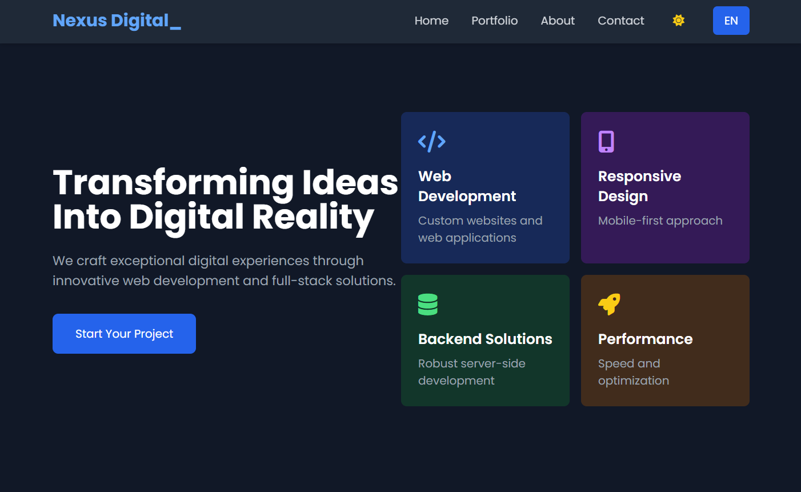

# Nexos Digital Lab / Laboratório Digital Nexos

## Description / Descrição
Nexos Digital Lab is a web development portfolio showcasing services in web development and full-stack programming.  
O Laboratório Digital Nexos é um portfólio de desenvolvimento web que apresenta serviços em desenvolvimento web e programação full-stack.

## Features / Funcionalidades
- Home page with a welcome message and navigation links.  
- Página inicial com uma mensagem de boas-vindas e links de navegação.
- About page detailing the company's history and the programming tools used (HTML, CSS, JavaScript, Python, C, PHP, jQuery, SQL).  
- Página "Sobre" detalhando a história da empresa e as ferramentas de programação utilizadas no seu dia a dia  (HTML, CSS, JavaScript, Python, C, PHP, jQuery, SQL).
- Portfolio page showcasing projects with descriptions.  
- Página de portfólio exibindo projetos com descrições.
- Contact page with a form for users to reach out.  
- Página de contato com um formulário para os usuários entrarem em contato.

## Technologies Used / Tecnologias Utilizadas
- HTML 🟠  
- HTML 🟠
- CSS 🎨  
- CSS 🎨
- JavaScript 💻  
- JavaScript 💻
- Python 🐍  
- Python 🐍
- C 💾  
- C 💾
- PHP 🐘  
- PHP 🐘
- jQuery ⚙️  
- jQuery ⚙️
- SQL 📊  
- SQL 📊

## Getting Started / Começando
To set up the project locally, clone the repository and open the HTML files in your browser.  
Para configurar o projeto localmente, clone o repositório e abra os arquivos HTML em seu navegador.

## Contact Information / Informações de Contato
For inquiries, please reach out through the contact form on the website.  
Para consultas, entre em contato através do formulário de contato no site.
